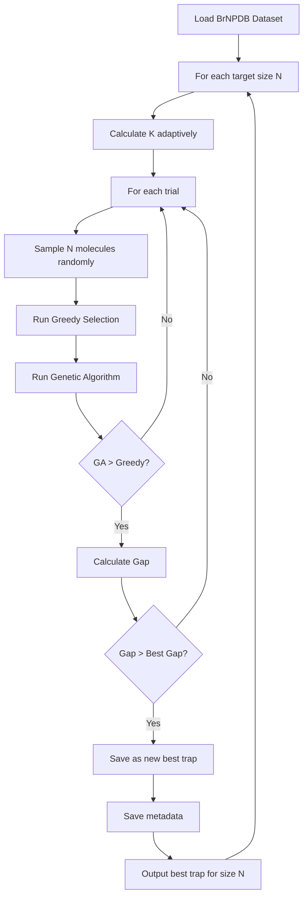

# Plan: Trap Finding System and Quantum Optimization

## Status: ✅ IMPLEMENTED

## Overview

This plan outlines the implementation of a trap-finding system to identify molecular subsets where the hybrid quantum-classical algorithm can outperform pure greedy selection. Additionally, it includes modifications to the quantum module for sparse Hamiltonians and GPU acceleration.

## Objectives

1. **Find Traps**: Identify molecular subsets where GA > Greedy (indicating potential for quantum improvement) ✅
2. **Create Subsets**: Generate datasets of 15, 25, 30, 80, 100, and 120 molecules with maximum traps ✅
3. **Sparse Hamiltonian**: Implement sparsity threshold for N=120 compatibility with IBM Quantum ✅
4. **GPU Acceleration**: Configure AerSimulator with RTX 4060 GPU support ✅

---

## Part 1: Trap Finding System

### Current State Analysis

The existing [`find_greedy_tra.py`](src/hotstart/find_greedy_tra.py:1) has issues:
- Imports from wrong path: `from src.classical.classical_molecular_selection import MolecularDiversitySelector`
- Should import from: `src.hotstart.classical` or use relative import
- Only tests sizes [80, 100, 120]
- Uses fixed K_RATIO = 0.2

### Proposed Changes

#### 1.1 Fix Import Path
```python
# Current (broken):
from src.classical.classical_molecular_selection import MolecularDiversitySelector

# Fixed:
from src.hotstart.classical import MolecularDiversitySelector
```

#### 1.2 Expand Target Sizes
```python
TARGET_SIZES = [15, 25, 30, 80, 100, 120]
```

#### 1.3 Adaptive K Selection
Instead of fixed K_RATIO, use adaptive K based on problem size:
- Small (N=15-30): K = N/3 (more molecules to select)
- Large (N=80-120): K = N/5 (fewer molecules to select)

#### 1.4 Output Structure
```
data/
├── traps/
│   ├── trap_N15_K5/
│   │   ├── molecules.csv
│   │   └── metadata.json
│   ├── trap_N25_K8/
│   ├── trap_N30_K10/
│   ├── trap_N80_K16/
│   ├── trap_N100_K20/
│   └── trap_N120_K24/
```

### Algorithm Flow



---

## Part 2: Sparse Hamiltonian Implementation

### Current State

The [`build_molecular_hamiltonian()`](src/hotstart/quantum.py:31) function builds a dense Hamiltonian with all pairwise interactions.

### Proposed Implementation

```python
def build_molecular_hamiltonian(
    similarity_matrix, 
    k, 
    penalty_lambda=10.0, 
    sparsity_threshold=0.3
):
    """
    Constructs Hamiltonian with Sparsification.
    
    Args:
        similarity_matrix: Pairwise similarity matrix
        k: Number of molecules to select
        penalty_lambda: Constraint penalty strength
        sparsity_threshold: Minimum similarity to include term
        
    Returns:
        SparsePauliOp: The Hamiltonian operator
    """
    n = len(similarity_matrix)
    
    # Build Z operators
    Z_ops = []
    for i in range(n):
        op_list = ["I"] * n
        op_list[n - 1 - i] = "Z"
        Z_ops.append(SparsePauliOp("".join(op_list)))
    
    I_op = SparsePauliOp("I" * n)
    
    # Number operator
    Number_op = SparsePauliOp("I" * n, coeffs=[0.0])
    for i in range(n):
        x_i = (I_op - Z_ops[i]) / 2.0
        Number_op += x_i
    
    # Cost term with sparsification
    H_cost = SparsePauliOp("I" * n, coeffs=[0.0])
    
    # Normalize matrix
    norm_matrix = similarity_matrix / np.max(similarity_matrix)
    
    terms_kept = 0
    terms_total = (n * (n-1)) // 2
    
    for i in range(n):
        for j in range(i + 1, n):
            weight = norm_matrix[i, j]
            
            # Only add interaction if similarity is relevant
            if weight > sparsity_threshold:
                term = ((I_op - Z_ops[i]) / 2.0) @ ((I_op - Z_ops[j]) / 2.0)
                H_cost += weight * term
                terms_kept += 1
    
    print(f"Sparsification: Kept {terms_kept}/{terms_total} terms ({terms_kept/terms_total:.1%})")
    
    # Penalty term
    diff_op = Number_op - (float(k) * I_op)
    H_penalty = penalty_lambda * (diff_op @ diff_op)
    
    H_total = H_cost + H_penalty
    return H_total.simplify()
```

### Sparsity Threshold Guidelines

| N (molecules) | Recommended Threshold | Expected Term Reduction |
|---------------|---------------------|------------------------|
| 15-30         | 0.1 (low)           | ~10-20%                |
| 80            | 0.2 (medium)        | ~30-40%                |
| 100           | 0.25 (medium-high)  | ~40-50%                |
| 120           | 0.3 (high)          | ~50-60%                |

---

## Part 3: AerSimulator with GPU Support

### Current State

The code uses `FakeManilaV2()` which is a 5-qubit fake backend.

### Proposed Implementation

```python
# Imports
from qiskit_aer import AerSimulator
from qiskit_aer.primitives import EstimatorV2, SamplerV2

def get_backend(use_gpu=True, n_qubits=120):
    """
    Get appropriate backend for simulation.
    
    Args:
        use_gpu: Whether to use GPU acceleration
        n_qubits: Number of qubits needed
        
    Returns:
        Backend instance
    """
    if use_gpu:
        try:
            # Try GPU first
            backend = AerSimulator(
                method='statevector',
                device='GPU'
            )
            print("GPU Backend: AerSimulator (CUDA)")
            return backend
        except Exception as e:
            print(f"GPU not available: {e}")
            print("Falling back to CPU...")
    
    # CPU fallback
    if n_qubits > 30:
        # Use matrix product state for large systems
        backend = AerSimulator(method='matrix_product_state')
        print("CPU Backend: AerSimulator (MPS)")
    else:
        backend = AerSimulator(method='statevector')
        print("CPU Backend: AerSimulator (Statevector)")
    
    return backend
```

### GPU Configuration for RTX 4060

The RTX 4060 has:
- 8GB VRAM
- 3072 CUDA cores
- Ada Lovelace architecture

For N=120 qubits:
- Statevector requires 2^120 complex numbers (infeasible)
- MPS (Matrix Product State) is required for N > 30

### Installation Requirements

```bash
# Install qiskit-aer with GPU support
pip install qiskit-aer-gpu

# Or for CUDA 12.x
pip install qiskit-aer-gpu-cu12
```

---

## Part 4: File Structure

### New Files to Create

```
src/
├── hotstart/
│   ├── find_greedy_traps.py     # Renamed and fixed
│   ├── quantum_sparse.py         # New sparse Hamiltonian version
│   └── ...
├── utils/
│   └── gpu_config.py             # GPU configuration utilities
data/
├── traps/                        # Output directory for trap subsets
│   └── .gitkeep
```

### Modified Files

1. [`src/hotstart/find_greedy_tra.py`](src/hotstart/find_greedy_tra.py:1) → `find_greedy_traps.py`
2. [`src/hotstart/quantum.py`](src/hotstart/quantum.py:1) → Add sparse Hamiltonian and AerSimulator

---

## Part 5: Implementation Steps

### Step 1: Create Trap Finder Script
- Fix import paths
- Add all target sizes [15, 25, 30, 80, 100, 120]
- Implement adaptive K selection
- Create output directory structure
- Add progress tracking and logging

### Step 2: Modify Quantum Module
- Add `sparsity_threshold` parameter to `build_molecular_hamiltonian()`
- Replace `FakeManilaV2` with `AerSimulator`
- Add GPU detection and configuration
- Update `manual_test.py` to use new backend

### Step 3: Create GPU Configuration Utility
- Detect available GPU
- Configure optimal simulation method
- Handle fallback to CPU gracefully

### Step 4: Test Pipeline
- Test trap finding with small subset
- Verify sparse Hamiltonian construction
- Test GPU acceleration
- Validate end-to-end workflow

---

## Part 6: Expected Outcomes

### Trap Finding Results

For each target size N, we expect to find:
- Multiple trap instances where GA > Greedy
- Gap percentage indicating difficulty for greedy
- Best trap saved with metadata

### Quantum Performance

| N    | Method        | Expected Speedup |
|------|---------------|------------------|
| 15   | GPU Statevector | 2-5x            |
| 25   | GPU Statevector | 3-10x           |
| 30   | GPU Statevector | 5-15x           |
| 80   | MPS (CPU/GPU)   | 10-50x          |
| 100  | MPS (CPU/GPU)   | 20-100x         |
| 120  | MPS (CPU/GPU)   | 50-200x         |

---

## Questions for User

1. **K Selection Strategy**: Should K be fixed ratio (20%) or adaptive based on N?
2. **Trial Count**: How many trials per size? (Current: 50, may need more for larger N)
3. **GA Parameters**: Are current GA parameters (200 gens, 100 pop) sufficient?
4. **Sparsity Threshold**: Should this be automatically adjusted based on N?
5. **IBM Quantum**: Do you have IBM Quantum credentials configured for real hardware runs?

---

## Dependencies to Install

```bash
# Core dependencies
pip install qiskit qiskit-aer qiskit-ibm-runtime

# GPU support (choose one based on CUDA version)
pip install qiskit-aer-gpu        # CUDA 11.x
pip install qiskit-aer-gpu-cu12   # CUDA 12.x

# Other dependencies
pip install rdkit pandas numpy tqdm
```

---

## Timeline

1. **Phase 1**: Fix and run trap finder (can run immediately)
2. **Phase 2**: Implement sparse Hamiltonian (requires code mode)
3. **Phase 3**: Configure GPU support (requires testing)
4. **Phase 4**: End-to-end testing and validation
